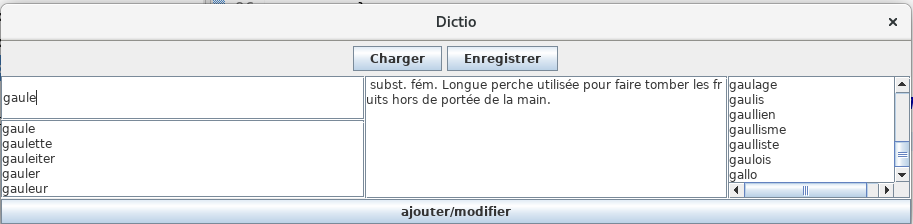
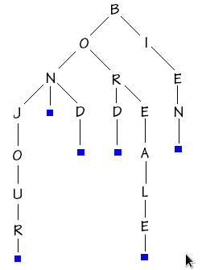

# DICTIO
## LOG100 - Programmation et réseautique Laboratoire 5 (sur deux semaines)
Un client vous contacte pour le développement d’un dictionnaire interactif, soit une application qu’il a
nommée DICTIO. Les fonctionnalités suivantes sont demandées :
1. Pouvoir charger et enregistrer les entrées du dictionnaire dans un fichier texte. Chaque entrée
est inscrite sur une ligne de la façon suivante : Mot & définion. Ici, le symbole « & » est utilisé
pour séparer le mot de la définition. La définition peut comprendre plusieurs phrases.
2. On doit pouvoir entrer un mot dans la zone du mot courant. En même temps qu’on tape chaque
lettre du mot, la liste des mots possibles (mots débutant par les lettres entrées) est proposée juste
en dessous. Si le mot entré est défini, sa définition apparaît au centre.
3. La liste de tous les mots est toujours visible à droite.
4. Il est possible d’ajouter et/ou modifier un mot. Pour ce faire, entrer ce mot dans la zone du mot
courant, éditer sa définition au centre et cliquer sur un bouton « ajouter/modifier » qui ajoutera
un nouveau mot ou mettra à jour la définition d’un mot existant.
Un aperçu de l’application désirée est présenté ci-dessous.

On vous demande plus particulièrement :
A. De développer l’application avec les exigences présentées plus haut.
B. De fournir un diagramme de classes UML de votre application
C. De fournir la documentation de votre code via la Javadoc. Attention à bien réaliser la Javadoc de
chaque en-tête de classe (qui doit décrire clairement les responsabilités de la classe et énumérer ses
collaborateurs). Décrivez bien chaque constructeur, méthode, leurs préconditions/postconditions, leurs
paramètres, valeurs de retour et la raison des exceptions qu’ils envoient.
D. Indiquez la complexité de vos méthodes récursives dans leurs en-têtes Javadoc.
Les contraintes de conceptions suivantes sont imposées :
1. Réalisé dans ecplise, en équipe de 2.
2. Les mots doivent être contenus dans un arbre lexicographique (voir annexe).
3. Les méthodes permettant d’ajouter, d’accéder et de modifier un mot doivent être implémentées de
façon récursive dans la classe LexiNode représentant le noeud de l’arbre lexicographique.
4. Une classe de tests unitaires doit valider les méthodes de LexiNode.

## ANNEXE
Un arbre lexicographique est présenté à titre d’exemple ci-dessous.
Chaque noeud (LexiNode) contient : une lettre représentante, un mot courant formé de la racine de
l’arbre jusqu’à la lettre représentante, une définition (vide si le mot courant n’est pas défini), et une
collection de références vers ses enfants. Remarquez que seule la lettre représentante de chaque noeud
est présentée dans le schéma ci-dessous.

## Astuces
- Lecture du fichier. Diverses options possibles à étudier (StringTokenizer, split de String, Regex...).
Lors de la lecture des mots dans le fichier, attention à ne pas inclure d’espace dans les caractères du
mot.
- Écriture du fichier. Plusieurs options, dont PrintWriter (assez convenant).
- Mise à jour de la liste des mots possible selon le mot courant. Comme la liste doit être mise à jour à
chaque modification de la zone de texte du mot courant, créez un KeyAdapter qui redéfinit la méthode
keyReleased (il sera possible d’obtenir le texte à jour dans cette méthode, contrairement par exemple à
keyPressed qui est invoqué par l’observateur avant la mise à jour du texte).
